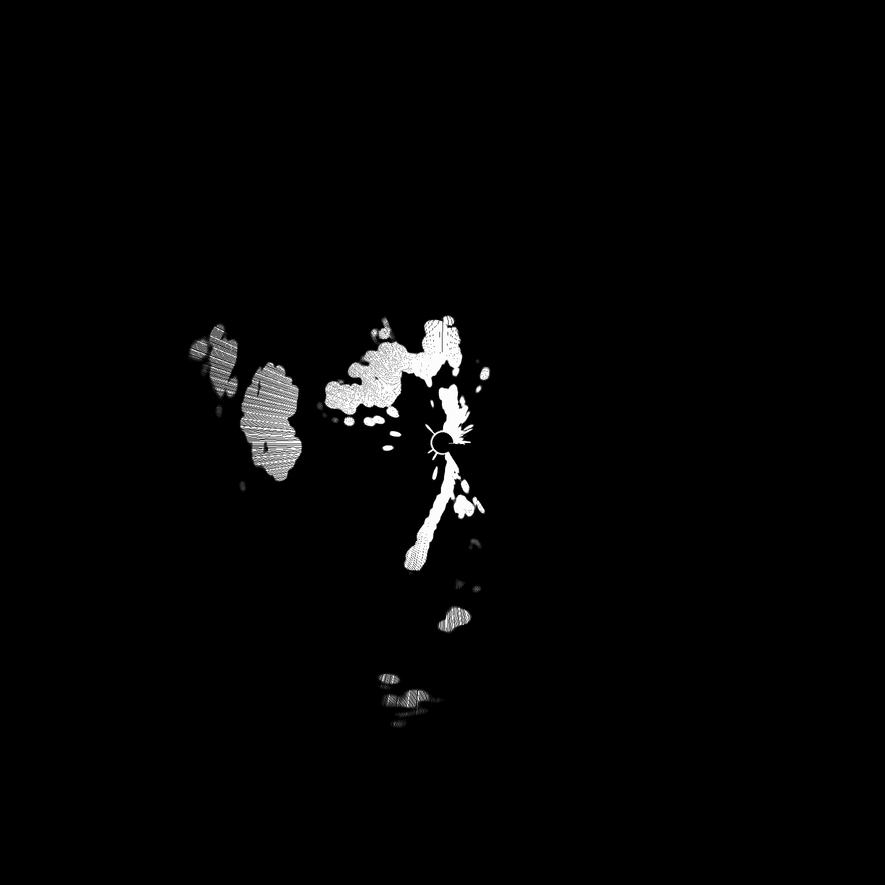

# Radar Plotter

Utility that turns Furuno radar CSV sweeps into grayscale polar PNGs for quick inspection or documentation.

## Build

```bash
g++ -std=c++17 csv_to_png.cpp stb_image_write.cpp -o csv_to_png
```

## Usage

```bash
./csv_to_png <input.csv> <output.png>
```

- `input.csv` must contain one sweep per row.
- The converter infers the image size from the longest sweep and draws every sample radially according to the recorded bearing (`Angle`).

## Sample Data

The repository ships with `samples/20250915_134537_352.csv` pulled straight from `/Users/jacobvaught/Downloads/RequestedPatterns/data_pattern14/`.

Each row starts with five metadata columns followed by hundreds of echo intensity samples:

| Column | Description                  |
| ------ | ---------------------------- |
| `Status` | Sensor health or validity flag |
| `Scale`  | Radar gain scale setting      |
| `Range`  | Range ring selection          |
| `Gain`   | Receiver gain level           |
| `Angle`  | Bearing encoded 0-8196 units  |
| `EchoValues...` | Radial echo magnitude per bin (0-255) |

First data row (truncated):

```csv
1,496,3,65,0,0,0,0,0,0,0,0,0,0,0,0,0,28,252,252,252,252,252,252,252,252,252,252,252,164,28,0,8,64,44,36,36,44,104,188,252,252,252,140,104,20,0,...
```

## Example Output

Running the converter locally:

```bash
./csv_to_png samples/20250915_134537_352.csv samples/20250915_134537_352.png
```

Generated PNG preview: 

Feel free to drop additional CSVs into `samples/` to document other captures. Keep builds out of git—`.gitignore` already excludes the compiled `csv_to_png` binary.
